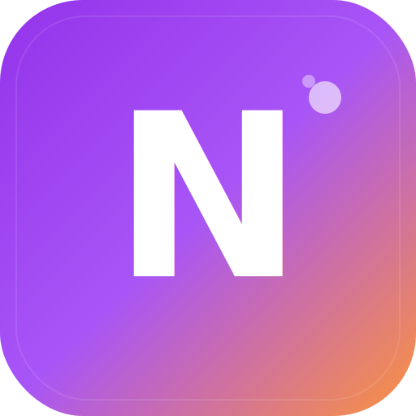

<p align="center">
  
</p>

<h1 align="center">Nexora</h1>

<p align="center">
  <strong>Connect Minds. Build Futures.</strong>
</p>

<p align="center">
  A modern professional networking platform that connects people through shared skills and interests.
</p>

<p align="center">
  <a href="#features">Features</a> •
  <a href="#tech-stack">Tech Stack</a> •
  <a href="#getting-started">Getting Started</a> •
  <a href="#api-documentation">API</a> •
  <a href="#pwa-support">PWA</a> •
  <a href="#contributing">Contributing</a>
</p>

<p align="center">
  
  
  
  
  
</p>

---

## 📖 Overview

**Nexora** is a full-stack professional networking platform designed to help individuals discover and connect with like-minded professionals based on their skills, interests, and goals. Unlike traditional networking platforms that focus on quantity, Nexora emphasizes quality connections that lead to meaningful collaborations and learning opportunities.

### 🎯 Mission

To create a space where professionals can:
- **Discover** people with complementary skills
- **Connect** through shared interests
- **Collaborate** on projects and ideas
- **Grow** together professionally

---

## ✨ Features

### 🔍 Smart Discovery
Intelligent matching algorithm that suggests connections based on your skills, interests, and professional goals.

### 💬 Real-Time Chat
Instant messaging powered by Socket.IO with:
- One-on-one conversations
- Message read receipts
- Online/offline status indicators
- Typing indicators

### 👥 Contact Management
- Send and receive connection requests
- Organize contacts efficiently
- Block/unblock users

### 📊 Analytics Dashboard
Personal dashboard with:
- Connection statistics
- Activity metrics
- Growth visualizations
- Recent activity feed

### 💻 Code Sharing
Share code snippets with syntax highlighting:
- Multiple language support
- Public/private snippets
- Copy to clipboard functionality

### 📋 Kanban Board
Built-in project management with drag-and-drop Kanban boards to organize your tasks and projects.

### 🔎 Advanced Search
Powerful user directory with:
- Skill-based filtering
- Interest matching
- Location filters
- Sorting options

### 📱 Progressive Web App (PWA)
Full PWA support for a native app experience:
- Install on any device
- Works offline
- Background sync
- Push notifications (coming soon)

### 🔐 Secure Authentication
- Email/password authentication
- Google OAuth 2.0
- JWT-based sessions
- Password hashing with bcrypt

---

## 🛠️ Tech Stack

### Frontend

| Technology | Version | Purpose |
|------------|---------|---------|
| **React** | 19.2 | UI Framework |
| **Vite** | 7.2 | Build Tool & Dev Server |
| **TailwindCSS** | 3.4 | Styling |
| **Framer Motion** | 12.x | Animations |
| **React Router** | 7.x | Client-side Routing |
| **Recharts** | 3.5 | Data Visualization |
| **Socket.IO Client** | 4.8 | Real-time Communication |
| **Axios** | 1.13 | HTTP Client |
| **Lucide React** | 0.555 | Icons |
| **@hello-pangea/dnd** | 18.0 | Drag & Drop |

### Backend

| Technology | Version | Purpose |
|------------|---------|---------|
| **Node.js** | 20+ | Runtime |
| **Express** | 4.18 | Web Framework |
| **MongoDB** | 7+ | Database |
| **Mongoose** | 8.0 | ODM |
| **Socket.IO** | 4.7 | Real-time Events |
| **JWT** | 9.0 | Authentication |
| **Passport** | 0.7 | OAuth Strategies |
| **Helmet** | 8.1 | Security Headers |
| **Joi** | 18.0 | Validation |
| **Pino** | 10.1 | Logging |
| **ioredis** | 5.8 | Redis Client (Caching) |

---

## 📁 Project Structure

```
nexora/
├── 📂 public/                    # Static assets & PWA files
│   ├── icon-*.png               # PWA icons (all sizes)
│   ├── icon.svg                 # Vector logo
│   ├── manifest.json            # PWA manifest
│   ├── sw.js                    # Service Worker
│   └── offline.html             # Offline fallback page
│
├── 📂 src/                       # Frontend source code
│   ├── 📂 components/           # Reusable UI components
│   │   ├── ButtonPrimary.jsx
│   │   ├── ErrorBoundary.jsx
│   │   ├── InstallPrompt.jsx
│   │   └── Navbar.jsx
│   │
│   ├── 📂 context/              # React Context providers
│   │   ├── AuthContext.jsx
│   │   └── ChatContext.jsx
│   │
│   ├── 📂 pages/                # Page components
│   │   ├── AdvancedSearchPage.jsx
│   │   ├── AuthCallback.jsx
│   │   ├── ChatPage.jsx
│   │   ├── CodeSharePage.jsx
│   │   ├── Dashboard.jsx
│   │   ├── DirectoryPage.jsx
│   │   ├── KanbanPage.jsx
│   │   ├── LandingPage.jsx
│   │   └── LoginPage.jsx
│   │
│   ├── 📂 services/             # API & service layer
│   │   ├── api.js               # Axios instance
│   │   ├── authService.js
│   │   ├── chatService.js
│   │   ├── codeService.js
│   │   ├── dashboardService.js
│   │   ├── landingService.js
│   │   ├── notificationService.js
│   │   ├── socketService.js
│   │   ├── userService.js
│   │   └── webRTCService.js
│   │
│   ├── App.jsx                  # Main app component
│   ├── main.jsx                 # Entry point
│   └── index.css                # Global styles
│
├── 📂 server/                    # Backend source code
│   ├── 📂 config/               # Configuration files
│   ├── 📂 middleware/           # Express middleware
│   │   ├── auth.js              # JWT authentication
│   │   └── ...
│   │
│   ├── 📂 models/               # Mongoose models
│   │   ├── User.js
│   │   ├── Chat.js
│   │   ├── Message.js
│   │   ├── Contact.js
│   │   ├── CodeSnippet.js
│   │   ├── Notification.js
│   │   ├── Session.js
│   │   ├── ActivityLog.js
│   │   └── AIResponse.js
│   │
│   ├── 📂 routes/               # API routes
│   │   ├── auth.js              # Authentication
│   │   ├── users.js             # User management
│   │   ├── chats.js             # Chat operations
│   │   ├── messages.js          # Message operations
│   │   ├── contacts.js          # Contact management
│   │   ├── code.js              # Code snippets
│   │   ├── dashboard.js         # Analytics
│   │   ├── landing.js           # Public data
│   │   └── apiVersions.js       # Version management
│   │
│   ├── 📂 socket/               # Socket.IO handlers
│   ├── 📂 utils/                # Utility functions
│   ├── index.js                 # Server entry point
│   └── seed.js                  # Database seeder
│
├── 📂 scripts/                   # Build & utility scripts
│   └── generate-icons.cjs       # PWA icon generator
│
├── index.html                   # HTML template
├── package.json                 # Frontend dependencies
├── vite.config.js               # Vite configuration
├── tailwind.config.js           # Tailwind configuration
└── postcss.config.js            # PostCSS configuration
```

---

## 🚀 Getting Started

### Prerequisites

- **Node.js** 20.x or higher
- **MongoDB** 7.x or higher (local or Atlas)
- **npm** or **yarn**
- **Git**

### Installation

#### 1. Clone the Repository

```bash
git clone https://github.com/yourusername/nexora.git
cd nexora
```

#### 2. Install Frontend Dependencies

```bash
npm install
```

#### 3. Install Backend Dependencies

```bash
cd server
npm install
cd ..
```

#### 4. Configure Environment Variables

Create a `.env` file in the `server` directory:

```env
# Server Configuration
PORT=5000
NODE_ENV=development

# Database
MONGODB_URI=mongodb://localhost:27017/nexora

# Authentication
JWT_SECRET=your-super-secret-jwt-key-change-this-in-production
JWT_EXPIRES_IN=7d

# Google OAuth (optional)
GOOGLE_CLIENT_ID=your-google-client-id
GOOGLE_CLIENT_SECRET=your-google-client-secret
GOOGLE_CALLBACK_URL=http://localhost:5000/api/auth/google/callback

# Redis (optional, for caching)
REDIS_URL=redis://localhost:6379

# Frontend URL (for CORS)
CLIENT_URL=http://localhost:5173
```

#### 5. Start MongoDB

```bash
# If using local MongoDB
mongod
```

#### 6. Seed the Database (Optional)

```bash
cd server
npm run seed
```

#### 7. Start the Development Servers

**Terminal 1 - Backend:**
```bash
cd server
npm run dev
```

**Terminal 2 - Frontend:**
```bash
npm run dev
```

#### 8. Open in Browser

Navigate to `http://localhost:5173`

---

## 📱 PWA Support

Nexora is a fully-featured Progressive Web App that can be installed on any device.

### PWA Features

| Feature | Status | Description |
|---------|--------|-------------|
| **Installable** | ✅ | Add to home screen on iOS, Android, Windows, Mac |
| **Offline Mode** | ✅ | Works without internet connection |
| **App Icons** | ✅ | 12 optimized sizes (16px - 512px) |
| **Splash Screens** | ✅ | Custom launch screens for iOS |
| **App Shortcuts** | ✅ | Quick access to Dashboard, Chat, Discover |
| **Background Sync** | ✅ | Sync data when connection restored |
| **Share Target** | ✅ | Receive shared content from other apps |
| **Standalone Mode** | ✅ | Runs in its own window |
| **Push Notifications** | 🔜 | Coming soon |

### Manifest Configuration

```json
{
  "name": "Nexora - Professional Networking",
  "short_name": "Nexora",
  "display": "standalone",
  "theme_color": "#9333ea",
  "background_color": "#ffffff",
  "orientation": "any",
  "categories": ["social", "productivity", "business"]
}
```

### Service Worker

The service worker (`public/sw.js`) implements:
- **Cache-first** strategy for static assets
- **Network-first** strategy for API calls
- **Stale-while-revalidate** for images
- **Offline fallback** page

### Generating PWA Icons

```bash
node scripts/generate-icons.cjs
```

This generates all required icon sizes from `public/icon.svg`.

---

## 📚 API Documentation

### Base URL

```
Development: http://localhost:5000/api
Production:  https://your-domain.com/api
```

### Authentication

All protected endpoints require a JWT token in the Authorization header:

```
Authorization: Bearer <token>
```

### Endpoints

#### Auth Routes (`/api/auth`)

| Method | Endpoint | Description |
|--------|----------|-------------|
| `POST` | `/register` | Register new user |
| `POST` | `/login` | Login with email/password |
| `POST` | `/logout` | Logout user |
| `GET` | `/me` | Get current user |
| `GET` | `/google` | Initiate Google OAuth |
| `GET` | `/google/callback` | Google OAuth callback |

#### User Routes (`/api/users`)

| Method | Endpoint | Description |
|--------|----------|-------------|
| `GET` | `/` | Get all users (with filters) |
| `GET` | `/:id` | Get user by ID |
| `PUT` | `/profile` | Update current user profile |
| `PUT` | `/skills` | Update skills |
| `PUT` | `/interests` | Update interests |
| `DELETE` | `/account` | Delete account |

#### Chat Routes (`/api/chats`)

| Method | Endpoint | Description |
|--------|----------|-------------|
| `GET` | `/` | Get all user chats |
| `POST` | `/` | Create new chat |
| `GET` | `/:id` | Get chat by ID |
| `DELETE` | `/:id` | Delete chat |

#### Message Routes (`/api/messages`)

| Method | Endpoint | Description |
|--------|----------|-------------|
| `GET` | `/chat/:chatId` | Get messages for chat |
| `POST` | `/` | Send new message |
| `PUT` | `/:id/read` | Mark message as read |
| `DELETE` | `/:id` | Delete message |

#### Contact Routes (`/api/contacts`)

| Method | Endpoint | Description |
|--------|----------|-------------|
| `GET` | `/` | Get all contacts |
| `POST` | `/request` | Send connection request |
| `PUT` | `/accept/:id` | Accept request |
| `PUT` | `/reject/:id` | Reject request |
| `DELETE` | `/:id` | Remove contact |

#### Code Routes (`/api/code`)

| Method | Endpoint | Description |
|--------|----------|-------------|
| `GET` | `/` | Get user's snippets |
| `POST` | `/` | Create snippet |
| `GET` | `/:id` | Get snippet by ID |
| `PUT` | `/:id` | Update snippet |
| `DELETE` | `/:id` | Delete snippet |

#### Dashboard Routes (`/api/dashboard`)

| Method | Endpoint | Description |
|--------|----------|-------------|
| `GET` | `/stats` | Get user statistics |
| `GET` | `/activity` | Get recent activity |

#### Landing Routes (`/api/landing`)

| Method | Endpoint | Description |
|--------|----------|-------------|
| `GET` | `/stats` | Get platform statistics |
| `GET` | `/skills` | Get popular skills |
| `GET` | `/interests` | Get popular interests |
| `GET` | `/testimonials` | Get testimonials |

---

## 🔌 WebSocket Events

### Client → Server

| Event | Payload | Description |
|-------|---------|-------------|
| `join` | `{ userId }` | Join user room |
| `message:send` | `{ chatId, content }` | Send message |
| `typing:start` | `{ chatId }` | User started typing |
| `typing:stop` | `{ chatId }` | User stopped typing |
| `message:read` | `{ messageId }` | Mark message as read |

### Server → Client

| Event | Payload | Description |
|-------|---------|-------------|
| `message:new` | `{ message }` | New message received |
| `user:online` | `{ userId }` | User came online |
| `user:offline` | `{ userId }` | User went offline |
| `typing:update` | `{ chatId, userId, isTyping }` | Typing indicator |
| `notification:new` | `{ notification }` | New notification |

---

## 🗄️ Database Schema

### User Model

```javascript
{
  username: String,
  email: String,
  password: String (hashed),
  avatar: String,
  bio: String,
  location: String,
  skills: [String],
  interests: [String],
  isOnline: Boolean,
  lastSeen: Date,
  googleId: String,
  createdAt: Date,
  updatedAt: Date
}
```

### Chat Model

```javascript
{
  participants: [ObjectId → User],
  lastMessage: ObjectId → Message,
  createdAt: Date,
  updatedAt: Date
}
```

### Message Model

```javascript
{
  chat: ObjectId → Chat,
  sender: ObjectId → User,
  content: String,
  type: String (text, image, file),
  readBy: [ObjectId → User],
  createdAt: Date
}
```

### Contact Model

```javascript
{
  requester: ObjectId → User,
  recipient: ObjectId → User,
  status: String (pending, accepted, rejected, blocked),
  createdAt: Date,
  updatedAt: Date
}
```

### CodeSnippet Model

```javascript
{
  author: ObjectId → User,
  title: String,
  description: String,
  code: String,
  language: String,
  isPublic: Boolean,
  createdAt: Date,
  updatedAt: Date
}
```

---

## 🧪 Running Tests

```bash
# Frontend tests
npm run test

# Backend tests
cd server
npm run test

# E2E tests
npm run test:e2e
```

---

## 🏗️ Building for Production

### Frontend Build

```bash
npm run build
```

Output will be in the `dist/` directory.

### Backend Production

```bash
cd server
npm start
```

### Environment Variables for Production

```env
NODE_ENV=production
MONGODB_URI=mongodb+srv://...
JWT_SECRET=<strong-random-string>
CLIENT_URL=https://your-domain.com
```

---

## 🚢 Deployment

### Frontend (Vercel/Netlify)

1. Connect your GitHub repository
2. Set build command: `npm run build`
3. Set output directory: `dist`
4. Deploy

### Backend (Railway/Render/Heroku)

1. Connect your GitHub repository
2. Set environment variables
3. Set start command: `npm start`
4. Deploy

### Full Stack (Docker)

```dockerfile
# Coming soon
```

---

## 🤝 Contributing

We welcome contributions! Please follow these steps:

1. **Fork** the repository
2. **Create** a feature branch (`git checkout -b feature/amazing-feature`)
3. **Commit** your changes (`git commit -m 'Add amazing feature'`)
4. **Push** to the branch (`git push origin feature/amazing-feature`)
5. **Open** a Pull Request

### Code Style

- Use ESLint configuration
- Follow React best practices
- Write meaningful commit messages
- Add comments for complex logic

---

## 📄 License

This project is licensed under the MIT License - see the [LICENSE](LICENSE) file for details.

---

## 👨‍💻 Author

**Selva Kumaran**

- LinkedIn: [@selva-kumaran](https://www.linkedin.com/in/selva-kumaran-a6529a321/)
- GitHub: [@selvakumaran](https://github.com/selvakumaran)

---

## 🙏 Acknowledgments

- [React](https://react.dev/) - UI Framework
- [Vite](https://vitejs.dev/) - Build Tool
- [TailwindCSS](https://tailwindcss.com/) - CSS Framework
- [Socket.IO](https://socket.io/) - Real-time Engine
- [MongoDB](https://www.mongodb.com/) - Database
- [Lucide](https://lucide.dev/) - Icon Library
- [Framer Motion](https://www.framer.com/motion/) - Animations

---

<p align="center">
  Made with ❤️ by the Nexora Team
</p>

<p align="center">
  <a href="#top">⬆️ Back to Top</a>
</p>
